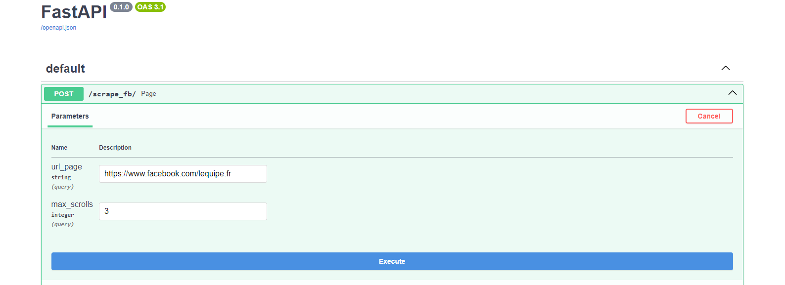

# Facebook Scraper API

This FastAPI application provides an API endpoint `/scrape_fb/` to scrape Facebook pages for posts, comments, and shares using Selenium.

## Quickstart - without Docker

To clone the project and install the dependencies:
```
git clone https://github.com/BabchiaA/facebook-scraper.git
pip install -r requirements.txt
```


## How the code works

The application will take as input the credentials of the facebook account as well as the url of the page to be scrolled and the number of times you want to scroll_down (the greater the scroll_down, the more posts will be scrolled).


On the database side, our application will construct the facebook_posts table with the following structure:
- post: content of the publication
- comments: number of comments
- shares: number of shares


